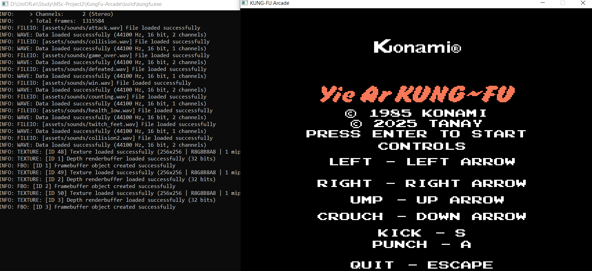

# YKungFu-Arcade

THe arcade classic Yie Ar Kung-Fu's remake created in C++ using raylib.

## Controls

* Move left = Left directional key
* Move right = right directional key
* Jump = up directional key
* Crouch = down directional key
* Kick = S letter key
* Punch = A letter key
* Quit = Escape key

## Screenshot
